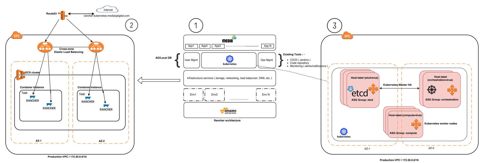

# Rancher-HA setup using Terraform

This repository includes terraform template to setup Rancher setup for Kubernetes-HA on AWS Cloud Platform.

## Getting Started

The Terraform template inside this repository will create the infrastructure as below diagram.



Resources:

+ AWS ECS Cluster 
+ Autoscaling Group for ECS Nodes
+ Loab Balancer (With SSL) to Serve Rancher UI
+ Map LoadBalancer with Rancher-Endpoint in Route53
+ Service and Task Definition to run Rancher Application in ECS
+ 3 Autoscaling group (Compute, etcd, orchestration)

### Prerequisites

To use this repository, following things need to be setup in your local machine/server

1. [Terraform 0.11.3](https://www.terraform.io/downloads.html)
2. [Rancher CLI](http://rancher.com/docs/rancher/v1.2/en/cli/)
3. AWS Credentials or Role configured (Should have permisson to create above Resources)

## Deployment

After cloning this repository, hit below commands.
```
terraform plan
```

This will tell you what all resources will be going to create. After that hit below command to deploy the resources.

```
terraform apply
```

## CleanUp

To remove all the resources, type below command
```
terraform destroy
```

